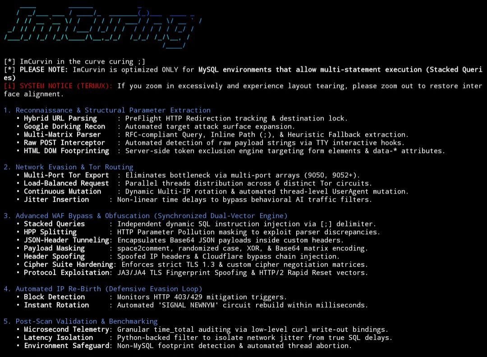

## ImCurvin ScreenShots Gallery
---

**This output will be generated upon executing this script with the option -skip. (Current Version)**

**This output will be generated upon executing this script. [Legacy]**

**This output will appear if the '-shwpld' option is enabled.**

**Read this if you HAVE NOT YET, to prevent unintended actions. Or read it on Mode.md.**
