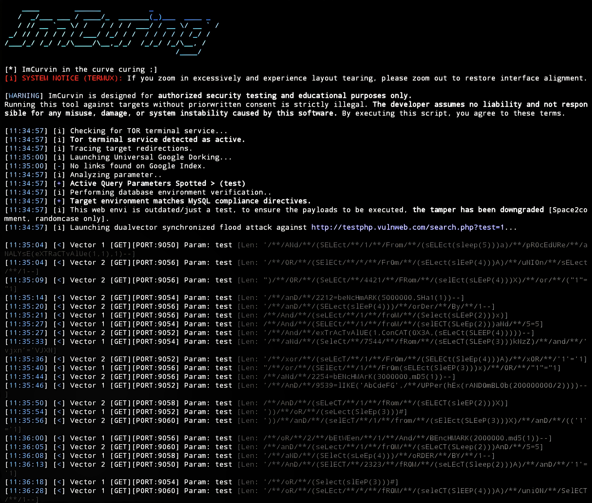

## ImCurvin ScreenShots Gallery
---

This output will be generated upon executing this script.

This output will be displayed when the '-rec' option is executed.

This output will appear if the '-shwpld' option is enabled.

Read thus if you HAVE NOT YET, to prevent unintended actions. Or read it on Mode.md.