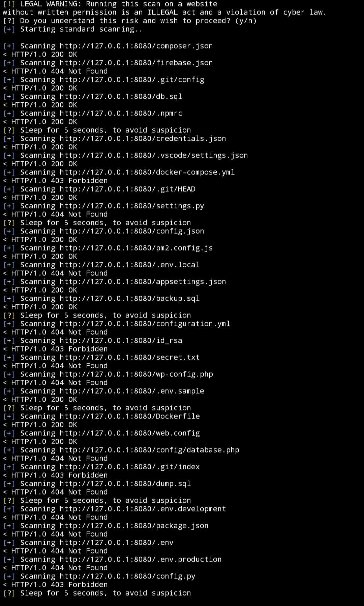
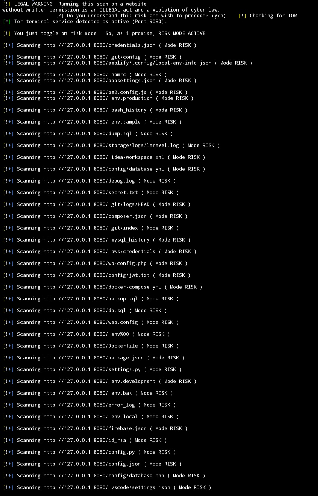
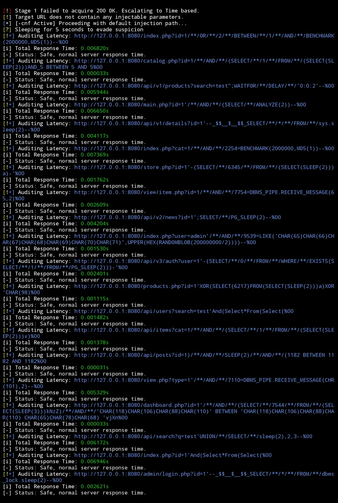
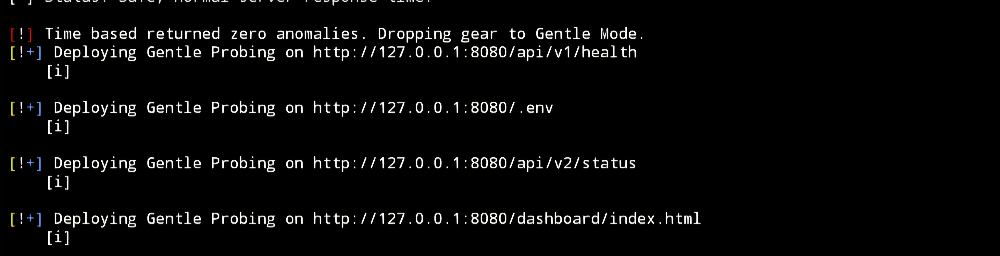
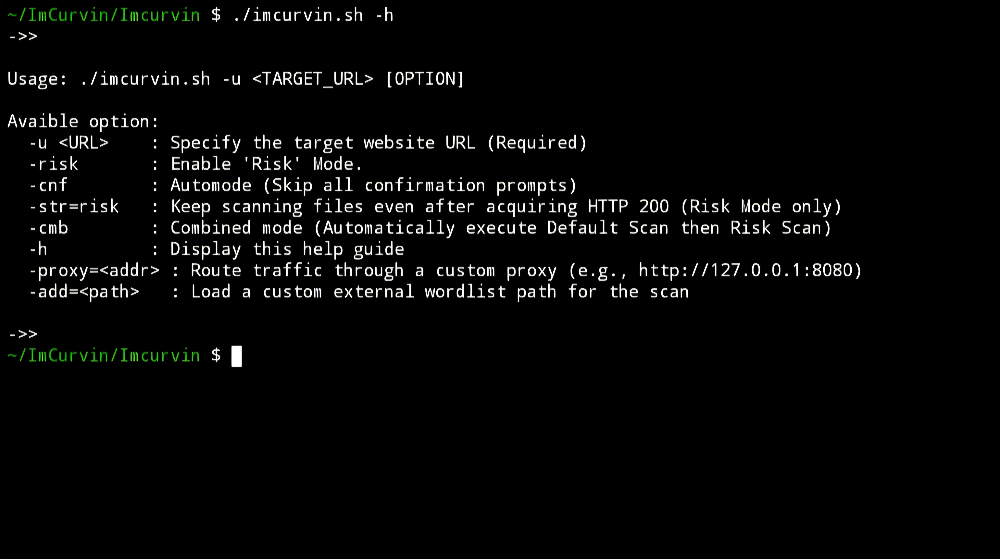

## ImCurvin' ScreenShots Gallery

Default Scan output:

Risk scan output (RiskNormal):

Risk scan output (TimeBased):

Risk scan output. Discontinued. To reiterate, scanning a local server is technically impossible.

**Test:**
Using the option -h;
