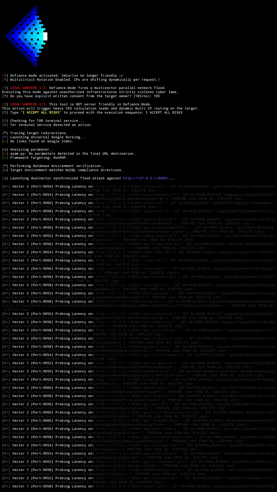

## ImCurvin' ScreenShots Gallery

**Default:**

Default Scan output:

**Risk & Defiance:**

Note: This is a simulated screenshot for demonstration purposes. Running an actual scan on a localhost server via Tor is technically impossible. No output here, just the process.

**Risk scan output:** RiskNormal (Targets):

**Risk scan output:** TimeBased (Sqli):

**Risk scan output.** *Discontinued*. To reiterate, scanning a local server is technically impossible: Gentle (Calm, but it is forcing)

Defiance mode Screenshoot (No nerf sub-mode):

