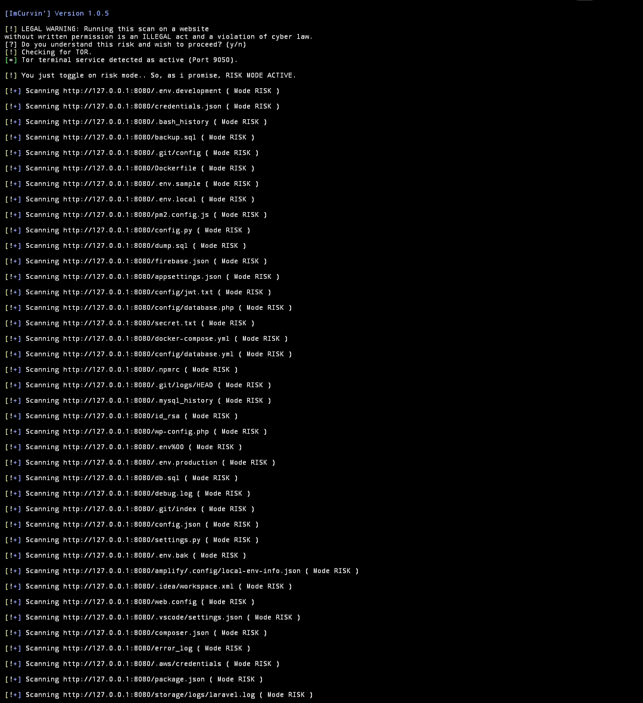
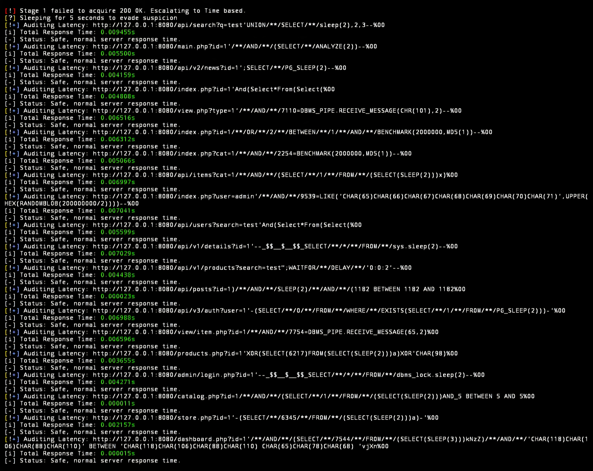
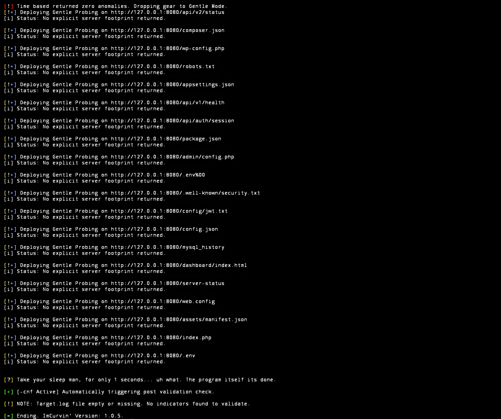
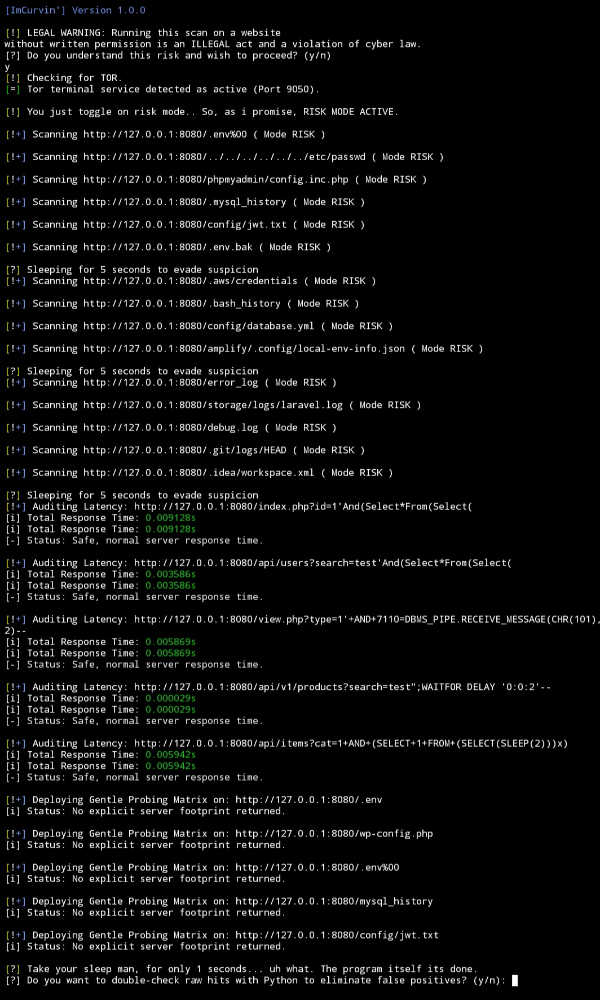

## ImCurlin' ScreenShots Gallery

**v1.0.5**

Default Scan output:

/Defaultscan1.0.5.jpg)

Risk scan output (RiskNormal):

Risk scan output (TimeBased):

Risk scan output, also notice that i use -cnf (Gentle):

**v1.0.0**

Risk scan output:

You can see more at screenshoots folder.